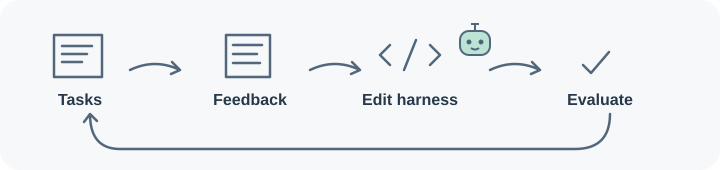
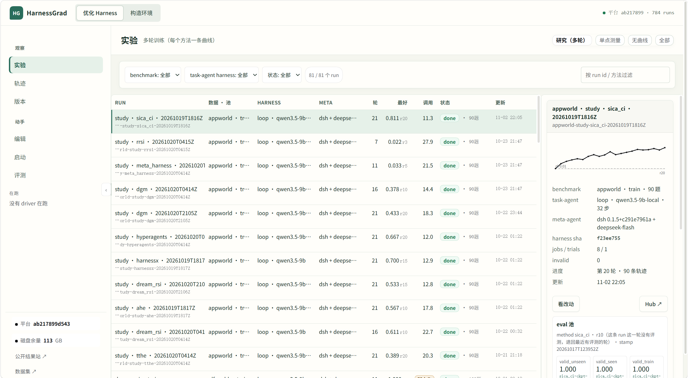
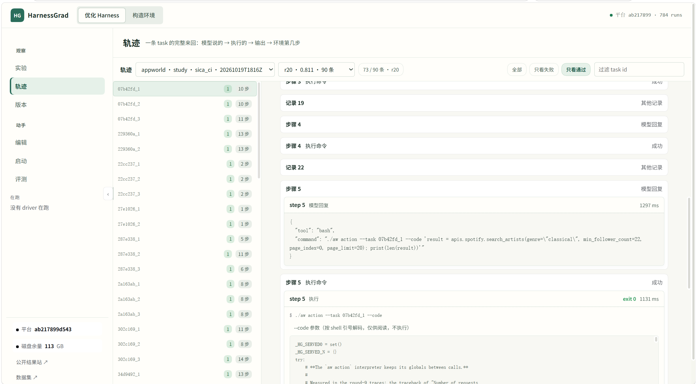
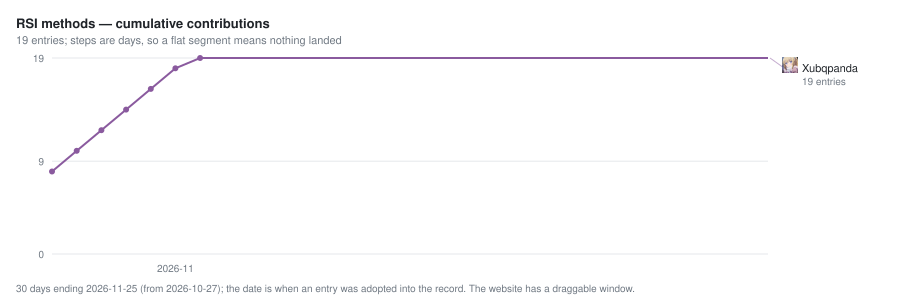

<p align="center">
  
</p>

<h1 align="center">HarnessGrad: Harness as A Continual Learner</h1>

<p align="center"><strong>One project for building better agent harnesses.</strong><br>Run reproducible experiments, customize a harness for your task,<br>and explore a path toward continual improvement.</p>

<p align="center">🧭 <a href="#table-of-contents">Contents</a> · 🧪 <a href="#run-experiments">Experiments</a> · 🛠️ <a href="#customize-harness">Customize</a> · 🌱 <a href="#evolve-personal-harness">Evolve</a> · 📚 <a href="docs/README.md">Docs</a> · 📖 <a href="#citation">Citation</a></p>

<p align="center"></p>

<p align="center">
  <a href="https://zjunlp.github.io/HarnessGrad/"></a>
  <a href="LICENSE"></a>
  
  
  <a href="https://github.com/zjunlp/HarnessGrad/actions/workflows/quality.yml"></a>
</p>

<a id="choose-your-path"></a>

## ✨ Choose your path

<table>
  <tr>
    <td align="center" width="33%"><h3>🧪 Run experiments</h3><p>Compare harnesses and RSI methods with recorded results.</p><a href="#run-experiments"><strong>Explore experiments →</strong></a></td>
    <td align="center" width="33%"><h3>🛠️ Customize a harness</h3><p>Edit and test a harness for your model or task.</p><a href="#customize-harness"><strong>Explore customization →</strong></a></td>
    <td align="center" width="33%"><h3>🌱 Evolve your harness</h3><p>Explore research on harness evolution.</p><a href="#evolve-personal-harness"><strong>Explore evolution →</strong></a></td>
  </tr>
</table>

<a id="table-of-contents"></a>

## 🧭 Table of Contents

- [🧪 Run experiments](#run-experiments)
  - [Experiment integrations](#what-you-can-run) · [Where to start](#where-to-start)
  - [Execution and comparison](#why-one-command-is-enough) · [Installation](#installation)
  - [Dataset storage](#dataset-storage) · [Quick start](#quick-start)
  - [Experiment workbench](#the-workbench) · [Contributors](#contributors)
- [🛠️ Customize a harness](#customize-harness)
  - [Current capabilities](#customize-current) · [Quick start](#customize-quick-start)
  - [Customization workbench](#customize-workbench)
- [🌱 Evolve your personal harness](#evolve-personal-harness)
- [🧩 Shared foundation](#shared-foundation)
- [📚 Documentation](docs/README.md)
- [📖 Citation](#citation)
- [🔗 Related work](#related-work)
- [📜 License](#license)

> [!TIP]
> Expand a workflow below to see its guide and screenshots. The same Console supports experiment inspection and harness editing.

<a id="run-experiments"></a>

<details>
<summary><strong>🧪 Run experiments</strong> — compare harnesses and RSI methods under recorded conditions</summary>

### 🔬 From a question to an experiment

**Choose a harness → Select an RSI method → Run tasks → Inspect the evidence.** Use the same recorded conditions when comparing results, then explore the learning curve, versions and task trajectories in the Console.

<a id="what-you-can-run"></a>

### 🧩 Experiment integrations

A research run is one point in a **harness × method × benchmark** space: a *harness* solves tasks, a *method* proposes edits to that harness between rounds, and a *benchmark* scores each candidate. HarnessGrad provides tasks and scoring, isolated execution, and version control for candidate harnesses, with a recorded curve for each experiment.

> [!NOTE]
> The inventory lists declared integrations; each harness and benchmark has its own preparation and runtime requirements.

<details>
<summary>Full harness, method and benchmark inventory</summary>

The table records the inventory at this README revision; the benchmark row is checked against the declared adapters.

| axis | what ships | where |
| --- | --- | --- |
| **harnesses** | 8: `loop`, `codex`, `opencode`, `deepseek-harness`, `openclaw`, `miniagent`, `miniswe`, `oracle` | `base_harness/<name>/` |
| **RSI methods** | 19: `dgm`, `rrsi`, `adas`, `ahe`, `ace`, `skillopt`, `evoprompt`, `evo_harness`, `opro`, `tthe`, `dream_rsi`, `sica_ci`, `gepa`, `darwinx`, `arbor`, `hyperagents`, `meta_harness`, `harnessx`, `modular_rsi` | `experiments/method-<name>.json` |
| **benchmarks** | 56 declared adapters; preparation and runtime prerequisites vary — every one listed: `agentdojo`, `aime`, `alfworld`, `appworld`, `authored_example_fix_bug`, `bbeh`, `bfcl_v3`, `bird_minidev`, `browsecomp`, `chessbench_puzzles`, `cooperbench`, `costbench`, `costbench_dynamic`, `deepsearchqa`, `deepswe`, `ds1000`, `fever`, `gaia`, `gsm8k`, `harvey_lab`, `hle`, `hotpotqa`, `jericho`, `jobbench`, `kumo`, `livecodebench`, `livemathbench`, `locomo`, `math`, `math500`, `memoryagentbench`, `musique`, `nq`, `officeqa_pro`, `personamem_v2`, `physicsquestions`, `reasoning_gym`, `scienceworld`, `searchqa`, `sportsunderstanding`, `spreadsheetbench`, `spreadsheetbench2`, `strategyqa`, `strongreject`, `supergpqa`, `swe_bench`, `swe_bench_pro`, `tau2_bench`, `tau3_bench`, `tau_bench`, `terminal_bench`, `travelplanner`, `triviaqa`, `twowikimultihopqa`, `widesearch`, `workbench` | `data/datasets/`, detail in [`DATASETS.md`](DATASETS.md) |

</details>

<a id="where-to-start"></a>

### Where to start

- **Bring a harness:** supply a directory with `harness.json` and an entrypoint accepting `--task` and `--workdir`. See [bring your own harness](docs/bring-your-own-harness.md).
- **Bring a method:** supply a program that reads a trajectory and writes a candidate tree. See [bring your own method](docs/bring-your-own-method.md).
- **Bring a benchmark:** write an adapter that materialises tasks and runs its official scorer. See [dataset onboarding](docs/dataset-onboarding.md).

<a id="why-one-command-is-enough"></a>

### ⚙️ Why one command is enough

A harness supplies `harness.json` and an entrypoint accepting `--task` and `--workdir` ([interface](INTERFACE.md)). The platform runs dataset tasks and scoring, isolates execution, versions candidate harnesses, and records each run's outcomes and receipts. Dataset and harness prerequisites still need to be installed separately.

<a id="why-the-comparison-is-fair"></a>

### ⚖️ Why the comparison is fair

Each round records the candidate harness hash and its changes, alongside the run's model roles and measurement metadata.

> [!IMPORTANT]
> Compare results only when the task selection, scorer, models and other relevant conditions support it. Failed or incomplete measurements are not scores; do not substitute proxy scores under a benchmark name. See the [measurement policy](docs/refusal-policy.md).

<a id="installation"></a>

### 📦 Installation

Requires Linux, Python 3.12+, Git, [uv](https://docs.astral.sh/uv/getting-started/installation/), and a working `bubblewrap`. See the [first-use guide](docs/getting-started.md) for setup details.

```bash
git clone https://github.com/zjunlp/HarnessGrad.git
cd HarnessGrad
uv venv --seed --python 3.12 ~/.venvs/harnessgrad
source ~/.venvs/harnessgrad/bin/activate
uv pip install -e .
./install.sh --check
```

<a id="dataset-storage"></a>

### 🗂️ Dataset storage

Set the shared external dataset directory in your local `.env`:

```dotenv
HG_DATA_ROOT=/path/to/datasets
```

See [downloads](DOWNLOADS.md) for preparation and locations, and [datasets](DATASETS.md) for adapter details.

> [!TIP]
> New to HarnessGrad? The [first-use guide](docs/getting-started.md) includes an installation control that does not need a model call or dataset download.

<a id="quick-start"></a>

### 🚀 Quick start

Prepare Loop and GSM8K, then configure your OpenAI-compatible solver and editor endpoints. Replace the placeholders below and use a fresh run ID for each experiment. See the [experiment guide](docs/rsi-experiments.md) for details.

```bash
# The provided configuration uses GSM8K.
python tools/configure_harness.py --harness base_harness/loop --fetch
python tools/datasets.py --fetch --dataset gsm8k
python tools/prepare_dataset.py --dataset gsm8k
python tools/datasets.py --check --dataset gsm8k
export HG_AGENT_BACKEND=openai
export HG_AGENT_BASE_URL='YOUR_SOLVER_ENDPOINT_URL'
export HG_AGENT_MODEL='YOUR_SOLVER_MODEL_NAME'
export HG_AGENT_API_KEY='YOUR_SOLVER_API_KEY'
export HG_METHOD_BASE_URL='YOUR_EDITOR_ENDPOINT_URL'
export HG_METHOD_MODEL='YOUR_EDITOR_MODEL_NAME'
export HG_METHOD_API_KEY='YOUR_EDITOR_API_KEY'
HG_QUICKSTART_ID="dgm-$(python -c 'import uuid; print(uuid.uuid4().hex[:12])')"
harnessgrad run --config experiments/method-dgm.json --run-id "$HG_QUICKSTART_ID" --check-only --check-net
harnessgrad run --config experiments/method-dgm.json --run-id "$HG_QUICKSTART_ID" --fail-on-incomplete
python tools/analysis/run_summary.py "runs/$HG_QUICKSTART_ID"
```

<a id="the-workbench"></a>

### 🖥️ Experiment workbench

Use the shared Console to inspect experiments, harness versions and task trajectories.

```bash
export HG_CONSOLE_RUNS="$PWD/runs"  # existing run-record directory
python console/server.py --port 4460
```

Open [http://127.0.0.1:4460/](http://127.0.0.1:4460/) from the repository root, or point `HG_CONSOLE_RUNS` to another existing run-record directory. The Console binds to localhost by default.

<table>
  <tr>
    <td align="center"><a href=".github/assets/console-gallery/experiments.png"></a><br><strong>Experiments</strong></td>
    <td align="center"><a href=".github/assets/console-gallery/versions.png"></a><br><strong>Versions</strong></td>
  </tr>
  <tr>
    <td align="center"><a href=".github/assets/console-gallery/traces.png"></a><br><strong>Trajectories</strong></td>
  </tr>
</table>

<a id="contributors"></a>

### 🌱 Contributors

Thank you to everyone who contributes harnesses, methods, benchmarks, and improvements to HarnessGrad! The three charts show the most recent 30 days; each line includes contributions made before that window.

Want to join? [Bring a harness](docs/bring-your-own-harness.md), [add a method](docs/bring-your-own-method.md), or [onboard a benchmark](docs/dataset-onboarding.md), then open a pull request. We will add your name to the relevant contributor chart.

<!-- BEGIN contributors (generated by tools/contributors.py --write) -->





<!-- END contributors -->

</details>

<a id="customize-harness"></a>

<details>
<summary><strong>🛠️ Customize a harness</strong> — build for a model, environment or task</summary>

<a id="customize-current"></a>

### Current capabilities

**Choose a starting harness → Edit a candidate → Inspect the diff → Try it on tasks.**

Start from a base or saved candidate, edit its files with an assistant and evaluate the result. See [bring your own harness](docs/bring-your-own-harness.md). The [customization proposal command](docs/customization.md) can also generate an unevaluated candidate from explicitly supplied feedback and text, with options to refine instructions from failure feedback, propose memory-backed skills and export a source-checked patch for review.

> [!TIP]
> Already have a harness? Run `harnessgrad customize inspect --root ./my-harness` to see the components declared in its manifest, or see [bring your own harness](docs/bring-your-own-harness.md) for the entrypoint and manifest format.

<a id="customize-quick-start"></a>

### 🚀 Quick start

[Install HarnessGrad](docs/getting-started.md) and configure an OpenAI-compatible editor endpoint as described in the [customization guide](docs/customization.md). Choose the files and feedback you want to share with that endpoint; for example, put the following in `feedback.json`:

```json
[{"id": "review-1", "kind": "failure", "text": "The task ended without running the project tests."}]
```

```bash
harnessgrad customize collect --root ./my-harness --skill skills/main.md --feedback ./feedback.json > request.json
harnessgrad customize propose --request request.json --max-calls 8 > proposal.json
harnessgrad customize review --request request.json --proposal proposal.json --root ./my-harness
```

Replace `./my-harness` and `skills/main.md` with your own selected paths. The proposal includes candidate text and a diff for review; use the [guide](docs/customization.md#export-a-patch) to export a patch and test it on a copy.

<a id="customize-workbench"></a>

### Customization workbench

The same Console used to inspect experiments also provides a workspace for editing harness candidates. See the [workbench guide](console/WORKBENCH.md) for setup and sessions.

<p align="center"><a href=".github/assets/console-gallery/editor.png"></a><br><strong>Harness editor</strong></p>

</details>

<a id="evolve-personal-harness"></a>

<details>
<summary><strong>🌱 Evolve your personal harness</strong></summary>

Explore the [harness evolution protocol](docs/harness-evolution-protocol.md) and its approach to evaluating candidate improvements.

</details>

<a id="shared-foundation"></a>

## 🧩 Shared foundation

**One workbench for harness experiments and editing.** HarnessGrad provides harness adapters, improvement methods, candidate versions and evidence records. The Console brings experiment inspection and candidate editing together.

**Reusable improvement building blocks.** Shared proposal stages turn selected feedback into skill, memory and instruction candidates. Experiment workflows retain their measurement and selection rules; customization workflows choose their own inputs and review changes. See the [shared foundation](docs/shared-foundation.md) for the interfaces and an offline example.

<a id="citation"></a>

## 📖 Citation

If the platform, the measurement protocol or a curve produced here is useful in your work:

```bibtex
@misc{xu2026harnessgrad,
  title  = {HarnessGrad: Harness as A Continual Learner},
  author = {Buqiang Xu and Yenan Wang and Yutong Yu and Rongyao Li and
            Jintian Zhang and Shuofei Qiao and Xuehai Wang and Zirui Xue and
            Yijun Chen and Ningyu Zhang},
  year   = {2026},
}
```

<a id="related-work"></a>

## 🔗 Related work

<div align="center">
  <table>
    <tr>
      <td align="center" width="150">
        <a href="https://github.com/RUC-NLPIR/FlashRSI">
          
          <br />
          <sub><b>FlashRSI</b></sub>
        </a>
      </td>
      <td align="center" width="150">
        <a href="https://github.com/simple-agent-lab/RSIHub">
          
          <br />
          <sub><b>RSIHub</b></sub>
        </a>
      </td>
      <td align="center" width="150">
        <a href="https://github.com/Prism-Shadow/penguin-harness">
          
          <br />
          <sub><b>PenguinHarness</b></sub>
        </a>
      </td>
      <td align="center" width="150">
        <a href="https://github.com/quqxui/RSI-Flow">
          
          <br />
          <sub><b>RSI-Flow</b></sub>
        </a>
      </td>
    </tr>
  </table>
</div>

<a id="license"></a>

## 📜 License

MIT. Third-party benchmark code keeps its own licence and provenance next to the code that uses it (`PROVENANCE.json`, `LICENSE.upstream`).
